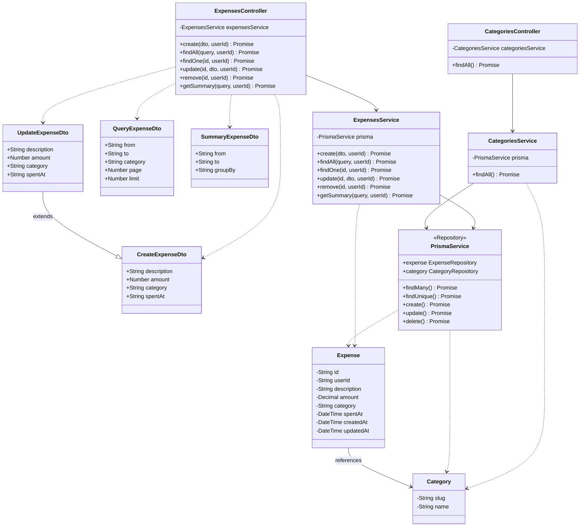

# Class Diagram - Expense Service

## UML Class Diagram (Đơn giản hóa)



## Kiến trúc Layered

```
┌─────────────────────────────────────┐
│         CONTROLLER LAYER            │
│  ExpensesController                 │
│  CategoriesController               │
│  (Nhận request, validate, response) │
└─────────────────┬───────────────────┘
                  │ uses
┌─────────────────▼───────────────────┐
│          SERVICE LAYER              │
│  ExpensesService                    │
│  CategoriesService                  │
│  (Business logic, validation)       │
└─────────────────┬───────────────────┘
                  │ uses
┌─────────────────▼───────────────────┐
│        REPOSITORY LAYER             │
│  PrismaService                      │
│  (Database access, queries)         │
└─────────────────┬───────────────────┘
                  │ accesses
┌─────────────────▼───────────────────┐
│         DATABASE LAYER              │
│  Expense Entity                     │
│  Category Entity                    │
│  (PostgreSQL)                       │
└─────────────────────────────────────┘

         ┌──────────────┐
         │  DTOs        │
         │  (Transfer)  │
         └──────────────┘
```

## Luồng xử lý:

**Request → Controller → Service → Repository → Database**

1. **Controller**: Nhận TCP message, validate DTO
2. **Service**: Xử lý business logic
3. **Repository (Prisma)**: Truy vấn database
4. **Entity**: Dữ liệu từ database
