# Class Diagram - Expense Service

## UML Class Diagram (Mermaid)

```mermaid
classDiagram
    %% ============= ENTITIES (DATABASE MODELS) =============
    class Expense {
        -String id
        -String userId
        -String description
        -Decimal amount
        -String category
        -DateTime spentAt
        -DateTime createdAt
        -DateTime updatedAt
    }

    class Category {
        -String slug
        -String name
    }

    %% ============= DTOs (DATA TRANSFER OBJECTS) =============
    class CreateExpenseDto {
        +String description
        +Number amount
        +String category
        +String spentAt
        +validate() void
    }

    class UpdateExpenseDto {
        +String description
        +Number amount
        +String category
        +String spentAt
    }

    class QueryExpenseDto {
        +String from
        +String to
        +String category
        +Number page
        +Number limit
    }

    class SummaryExpenseDto {
        +String from
        +String to
        +GroupByPeriod groupBy
    }

    class GroupByPeriod {
        <<enumeration>>
        DAY
        WEEK
        MONTH
        YEAR
    }

    %% ============= CONTROLLERS =============
    class ExpensesController {
        -ExpensesService expensesService
        +createMicroservice(payload: CreateExpenseDto & userId) Promise~Object~
        +findAllMicroservice(payload: QueryExpenseDto & userId) Promise~Object~
        +getSummaryMicroservice(payload: SummaryExpenseDto & userId) Promise~Object~
        +findOneMicroservice(payload: id, userId) Promise~Object~
        +updateMicroservice(payload: UpdateExpenseDto & id & userId) Promise~Object~
        +removeMicroservice(payload: id, userId) Promise~Object~
    }

    class CategoriesController {
        -CategoriesService categoriesService
        +findAll() Promise~Category[]~
    }

    class AppController {
        -AppService appService
        +getHealth() Object
    }

    %% ============= SERVICES =============
    class ExpensesService {
        -PrismaService prisma
        +create(dto: CreateExpenseDto, userId: String) Promise~Object~
        +findAll(query: QueryExpenseDto, userId: String) Promise~Object~
        +findOne(id: String, userId: String) Promise~Object~
        +update(id: String, dto: UpdateExpenseDto, userId: String) Promise~Object~
        +remove(id: String, userId: String) Promise~Object~
        +getSummary(query: SummaryExpenseDto, userId: String) Promise~Object~
        -validateCategory(category: String) Promise~void~
        -transformExpense(expense: Expense) Object
    }

    class CategoriesService {
        -PrismaService prisma
        +findAll() Promise~Category[]~
    }

    class AppService {
        +getHealth() Object
    }

    %% ============= DATABASE & INFRASTRUCTURE =============
    class PrismaService {
        <<extends PrismaClient>>
        +onModuleInit() Promise~void~
        +onModuleDestroy() Promise~void~
        +expense ExpenseDelegate
        +category CategoryDelegate
    }

    class PrismaClient {
        <<external library>>
        +$connect() Promise~void~
        +$disconnect() Promise~void~
    }

    %% ============= MODULES =============
    class AppModule {
        <<module>>
        +imports: Module[]
        +controllers: Controller[]
        +providers: Provider[]
    }

    class ExpensesModule {
        <<module>>
        +controllers: ExpensesController[]
        +providers: ExpensesService[]
        +exports: ExpensesService[]
    }

    class CategoriesModule {
        <<module>>
        +controllers: CategoriesController[]
        +providers: CategoriesService[]
        +exports: CategoriesService[]
    }

    %% ============= RELATIONSHIPS =============

    %% Module Dependencies
    AppModule ..> ExpensesModule : imports
    AppModule ..> CategoriesModule : imports
    AppModule o-- AppController : contains
    AppModule o-- AppService : provides
    AppModule o-- PrismaService : provides

    ExpensesModule o-- ExpensesController : contains
    ExpensesModule o-- ExpensesService : provides
    ExpensesModule ..> PrismaService : uses

    CategoriesModule o-- CategoriesController : contains
    CategoriesModule o-- CategoriesService : provides
    CategoriesModule ..> PrismaService : uses

    %% Controller Dependencies
    ExpensesController --> ExpensesService : depends on
    CategoriesController --> CategoriesService : depends on
    AppController --> AppService : depends on

    %% Service Dependencies
    ExpensesService --> PrismaService : uses
    CategoriesService --> PrismaService : uses
    PrismaService --|> PrismaClient : extends

    %% DTO Usage
    ExpensesController ..> CreateExpenseDto : uses
    ExpensesController ..> UpdateExpenseDto : uses
    ExpensesController ..> QueryExpenseDto : uses
    ExpensesController ..> SummaryExpenseDto : uses

    ExpensesService ..> CreateExpenseDto : uses
    ExpensesService ..> UpdateExpenseDto : uses
    ExpensesService ..> QueryExpenseDto : uses
    ExpensesService ..> SummaryExpenseDto : uses

    %% DTO Relationships
    UpdateExpenseDto --|> CreateExpenseDto : extends (PartialType)
    SummaryExpenseDto ..> GroupByPeriod : uses

    %% Database Model Usage
    ExpensesService ..> Expense : manages
    CategoriesService ..> Category : manages
    PrismaService o-- Expense : provides access
    PrismaService o-- Category : provides access

    %% Domain Relationships
    Expense --> Category : references by slug

    %% ============= NOTES =============
    note for ExpensesController "Handles TCP message patterns\nfrom API Gateway:\n- expense.create\n- expense.findAll\n- expense.findOne\n- expense.update\n- expense.remove\n- expense.summary"

    note for ExpensesService "Business Logic:\n- CRUD operations\n- Ownership validation\n- Category validation\n- Summary & statistics\n- Response transformation"

    note for PrismaService "Database Access Layer:\n- Connection management\n- Query execution\n- Transaction support"

    note for Expense "Primary Entity:\n- UUID identifier\n- Belongs to User\n- Optional Category\n- Indexed by userId, spentAt"

    note for Category "Reference Data:\n- Slug as primary key\n- Pre-seeded values"
```



## Giải thích Class Diagram

### 1. **Entities (Database Models)**

- **Expense**: Entity chính lưu trữ thông tin chi tiêu
  - Có quan hệ với Category qua trường `category` (Foreign Key)
  - Thuộc về một User (qua userId)
- **Category**: Danh mục chi tiêu được định nghĩa trước

### 2. **DTOs (Data Transfer Objects)**

- **CreateExpenseDto**: Dữ liệu để tạo expense mới (với validation)
- **UpdateExpenseDto**: Kế thừa từ CreateExpenseDto, tất cả fields optional
- **QueryExpenseDto**: Tham số query để lọc expenses (date range, category, pagination)
- **SummaryExpenseDto**: Tham số để lấy tổng hợp thống kê
- **GroupByPeriod**: Enum định nghĩa các khoảng thời gian nhóm (day, week, month, year)

### 3. **Controllers**

- **ExpensesController**: Nhận TCP messages từ API Gateway
  - Pattern: `expense.create`, `expense.findAll`, etc.
  - Chuyển request đến ExpensesService
- **CategoriesController**: Xử lý operations liên quan đến categories
  - Pattern: `category.findAll`
- **AppController**: Health check endpoint

### 4. **Services (Business Logic)**

- **ExpensesService**: Logic nghiệp vụ chính
  - CRUD operations
  - Validation (category, ownership)
  - Summary & statistics
  - Response transformation
- **CategoriesService**: Quản lý categories
- **AppService**: Application-level services

### 5. **Database & Infrastructure**

- **PrismaService**: Kế thừa từ PrismaClient
  - Quản lý kết nối database
  - Cung cấp access đến các models (Expense, Category)
  - Implement lifecycle hooks (onModuleInit, onModuleDestroy)

### 6. **Modules (NestJS Architecture)**

- **AppModule**: Root module
  - Import ExpensesModule và CategoriesModule
  - Provide global PrismaService
- **ExpensesModule**: Feature module cho expenses
- **CategoriesModule**: Feature module cho categories

## Quan hệ chính:

1. **Composition** (◆): Module chứa Controllers và Services
2. **Dependency** (→): Controller phụ thuộc Service, Service phụ thuộc PrismaService
3. **Usage** (..>): Service sử dụng DTOs và Entities
4. **Inheritance** (▷): UpdateExpenseDto extends CreateExpenseDto, PrismaService extends PrismaClient
5. **Association** (--): Expense tham chiếu Category

## Luồng xử lý request:

```
API Gateway (TCP) → ExpensesController → ExpensesService → PrismaService → PostgreSQL
                           ↓                    ↓
                     Validate DTO        Business Logic
```
